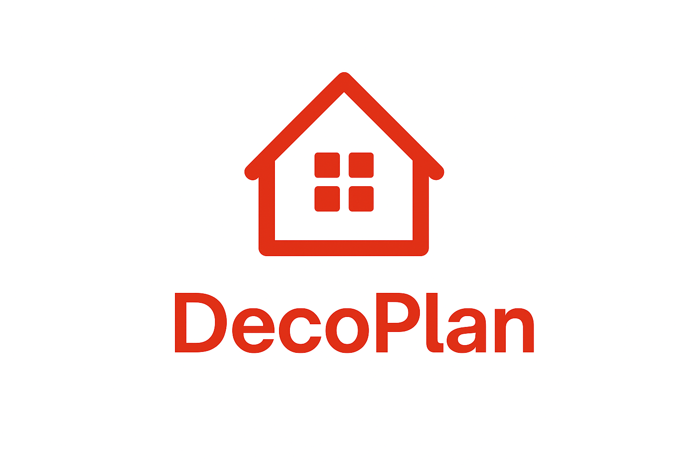

# DecoPlan LLM

AI-powered interior design assistant for Singapore BTOs and HDB layouts using multimodal vision-language models with **RAG (Retrieval-Augmented Generation)** and **LoRA (Low-Rank Adaptation)**.

## 🚀 Quick Start

### Backend Setup (Python)
```bash
# Install dependencies
pip install -r backend/requirements.txt

# Run setup script
bash scripts/setup/setup_rag_lora.sh

# Start API server
bash scripts/deployment/start_backend.sh
```

### Frontend Setup (React)
```bash
cd frontend
npm install
npm run dev
```

### C++ Inference
```bash
cd cpp
mkdir build && cd build
cmake .. -DDECOPLAN_USE_CUDA=ON
make -j$(nproc)
```

## 📋 Features

### 🐍 Backend (Python)
- **RAG System**: Semantic search over 10,000+ furniture items
- **LoRA Fine-tuning**: Efficient model adaptation for HDB-specific design
- **Flask API**: REST endpoints for furniture recommendations
- **Fast Retrieval**: <1 second query time on CPU

### ⚛️ Frontend (React + TypeScript)
- **Modern UI**: Built with React, TypeScript, and Tailwind CSS
- **Real-time Search**: Instant furniture recommendations
- **Advanced Filtering**: Filter by furniture type, style, material, color
- **Responsive Design**: Works on desktop and mobile

### 🔧 C++ Inference Engine
- **Vision-Language Models**: LLaVA, Qwen2-VL, Llama 3.2 Vision
- **CUDA Acceleration**: GPU-optimized inference
- **GGUF Support**: Quantized models (Q4_K_M, Q5_K_M)
- **Streaming**: Real-time token generation

## 📁 Project Structure

```
DecoPlan-LLM/
├── backend/              # 🐍 Python Backend
│   ├── api/             # Flask REST API
│   ├── rag/             # Retrieval-Augmented Generation
│   ├── lora/            # LoRA training & fine-tuning
│   └── tests/           # Backend tests
│
├── frontend/            # ⚛️ React Frontend
│   ├── src/
│   │   ├── components/  # UI components
│   │   ├── services/    # API services
│   │   └── types/       # TypeScript types
│   └── package.json
│
├── cpp/                 # 🔧 C++ Inference Engine
│   ├── include/         # Header files
│   ├── src/             # Source files
│   ├── examples/        # Example programs
│   └── CMakeLists.txt   # Build configuration
│
├── data/                # 📊 Data & Databases
│   ├── datasets/        # Furniture datasets (CSV)
│   └── furniture_db/    # Vector database (ChromaDB)
│
├── docs/                # 📚 Documentation
│   ├── setup/           # Installation & setup guides
│   ├── backend/         # Backend documentation
│   ├── cpp/             # C++ build & usage
│   └── api/             # API documentation
│
├── scripts/             # 🛠️ Utility Scripts
│   ├── setup/           # Setup & installation scripts
│   ├── deployment/      # Deployment scripts
│   ├── data/            # Data processing scripts
│   └── models/          # Model download scripts
│
├── models/              # 🤖 Model Files
│   └── *.gguf          # Quantized GGUF models
│
├── config/              # ⚙️ Configuration
│   ├── .clang-format
│   └── .vscode/
│
└── external/            # 📦 External Dependencies
    └── llama.cpp/       # llama.cpp submodule
```

## 📚 Documentation

- **[Migration Guide](MIGRATION_GUIDE.md)** - Adapting to the new structure
- **[Setup Guides](docs/setup/)** - Installation and quickstart
- **[Backend Docs](docs/backend/)** - RAG & LoRA system documentation
- **[C++ Docs](docs/cpp/)** - Build and usage instructions
- **[API Docs](docs/api/)** - REST API reference

## 🎯 Usage Examples

### Python Backend

**RAG Furniture Search:**
```bash
python -m backend.rag.furniture_retriever --query "modern minimalist sofa"
```

**Build Vector Database:**
```bash
python -m backend.rag.build_furniture_db
```

**Train LoRA Adapter:**
```bash
python -m backend.lora.train_lora
```

**Start API Server:**
```bash
cd backend/api
python app.py
```

### C++ Inference

```bash
cd cpp/build
./multimodal_inference \
    ../../models/llava-v1.6-mistral-7b.Q4_K_M.gguf \
    floor_plan.jpg \
    "Suggest furniture placement for this living room"
```

### Frontend

```bash
cd frontend
npm run dev    # Development server
npm run build  # Production build
```

## 🔧 System Requirements

### Backend (Python)
- **OS**: Linux, macOS, Windows (WSL2)
- **Python**: 3.8+
- **RAM**: 8GB minimum, 16GB recommended
- **Dependencies**: See `backend/requirements.txt`

### Frontend (React)
- **Node.js**: 18.0+
- **npm**: 9.0+

### C++ Inference
- **OS**: Linux, macOS, Windows (WSL2)
- **CPU**: x86_64 with AVX2 or ARM64
- **GPU** (Optional): NVIDIA GPU with CUDA 11.0+, or Apple Silicon (Metal)
- **VRAM**: 6GB minimum for Q4_K_M quantization
- **RAM**: 16GB minimum, 32GB recommended

## 🚢 Deployment

### Backend API
```bash
# Development
bash scripts/deployment/start_backend.sh

# Production (with gunicorn)
cd backend/api
gunicorn -w 4 -b 0.0.0.0:5000 app:app
```

### Frontend
```bash
cd frontend
npm run build
# Deploy the 'dist' folder to your hosting service
```

## 🛠️ Development

### Running Tests
```bash
# Backend tests
cd backend
python -m pytest tests/

# Frontend tests
cd frontend
npm test
```

### Code Formatting
```bash
# C++ (uses .clang-format)
cd cpp
clang-format -i src/*.cpp include/*.h

# Python (uses black)
cd backend
black .

# TypeScript/React (uses prettier)
cd frontend
npm run format
```

## 📊 Performance

| Component | Metric | Value |
|-----------|--------|-------|
| RAG Search | Query Time | <1 second (CPU) |
| RAG Database | Items | 10,000+ furniture pieces |
| C++ Inference | Model Size | 4-8GB (Q4_K_M) |
| C++ Inference | VRAM Usage | 6-8GB (7B model) |
| LoRA Training | Parameters | 1-2% trainable |
| LoRA Training | Time | 2-4 hours (12GB+ VRAM) |

## 🤝 Contributing

This is a university project for HDB/BTO interior design assistance. Contributions welcome!

1. Fork the repository
2. Create a feature branch
3. Make your changes
4. Run tests and formatting
5. Submit a pull request

## 📝 License

See [LICENSE](LICENSE) for details.

## 🙏 Acknowledgments

- Built on [llama.cpp](https://github.com/ggerganov/llama.cpp) by Georgi Gerganov
- Models from [Hugging Face](https://huggingface.co/) community
- Inspired by Singapore HDB interior design needs
- Vector database powered by [ChromaDB](https://www.trychroma.com/)
- Frontend UI components from [shadcn/ui](https://ui.shadcn.com/)

## 📞 Support

- **Documentation**: Check `docs/` directory
- **Migration Issues**: See [MIGRATION_GUIDE.md](MIGRATION_GUIDE.md)
- **Bug Reports**: Open an issue on GitHub

---

**Made with ❤️ for Singapore HDB/BTO Interior Design**
